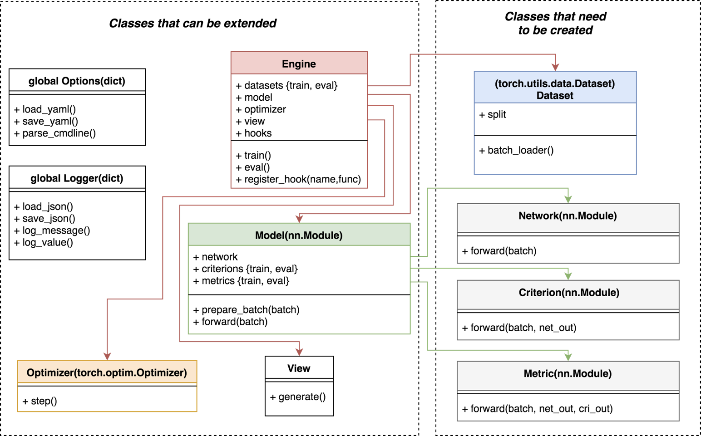
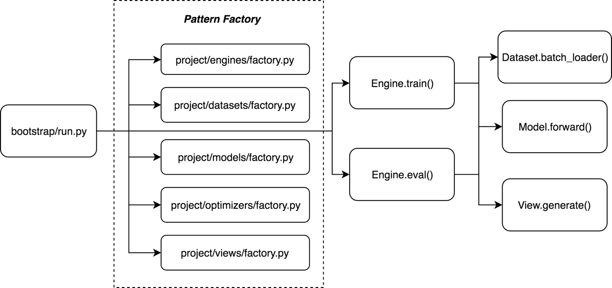

Concepts
========

Classes interactions:

Engine
------

The **core** of :mod:`Boostrap` is the class :class:`bootstrap.engines.engine.Engine` which contains training and evaluation methods that loop a given number of times over the provided dataset, model, optimizer and view.

The engine contains hooks calls that can be triggered at any time during the training and evaluation process. Each of the engine components are able to register hook functions.

.. code-block:: python

    engine.register_hook('train_on_update', display_learning_rate)

Also, we rely heavily on factories during the instantiation of the engine in order to provide optimal customizations:

.. code-block:: python

    engine = engines.factory()
    
    # dataset is a dictionary that contains all the needed datasets indexed by modes {train, eval}
    engine.dataset = datasets.factory(engine)

    # model includes a network, a criterion and a metric
    engine.model = models.factory(engine)

    engine.optimizer = optimizers.factory(engine.model, engine)

    # view will save a view.html in the experiment directory
    # with some nice plots and curves to monitor training
    engine.view = views.factory(engine)

Execution flow:

Dataset
-------

In Bootstrap, the dataset is fused with the data loader.

The only requirement for the dataset is to be of type :mod:`torch.utils.data.Dataset` and to have the method :mod:`make_batch_loader` which is called by the engine.

.. code-block:: python

    batch_loader = dataset.make_batch_loader()

    for i, batch in enumerate(batch_loader):
         # training or evaluation

Model
-----

The model is a torch.nn.Module composed of a network (ex: resnet152), a criterion (ex: nll) and a metric (ex: accuracy top1/top5).

During the forward pass, the model is in charge of passing the batch to the network, criterion, and metric. It outputs a loss value.

.. code-block:: python

    out = model(batch)
    out['loss'].backward()

To be flexible and support complex workflows, the criterions and metrics can vary during the training process depending on the mode (train or eval) or on the dataset split (train, val, test). 

Options
-------

The options class is one of the central components of Boostrap. It manages all of the (hyper) parameters of an experiment, and keeps them stored in a yaml file which is parsed to create default command line arguments.

.. code-block:: bash

    python –m bootstrap.run
           -o mnist/options/sgd.yaml
           -h

Options can be easily overwritten by command line arguments, facilitating hyper parameters search.

.. code-block:: bash

    python –m bootstrap.run
            -o mnist/options/sgd.yaml
            --exp.dir logs/example
            --model.metric.topk 1 2 3

For example, for an options file that look like this:

.. code-block:: yaml

    exp:
      dir: logs/mnist
      resume:
    dataset:
      import: mnist.datasets.factory
      name: mnist
      dir: data/mnist
      train_split: train
      eval_split: val
      nb_threads: 4
      batch_size: 64
    model:
      name: simple
        network:
          import: mnist.models.networks.factory
          name: lenet
        criterion:
          name: nll
        metric:
          name: accuracy
          topk: [1,5]
    optimizer:
      name: sgd
      lr: 0.01
    engine:
      name: default
      nb_epochs: 10
      saving_criteria:
        - loss:min
        - acctop1:max
    view:
      - logs:train_epoch.loss
      - logs:eval_epoch.acctop1

You can access every parameter with the singleton :class:`bootstrap.lib.options.Options` class.

.. code-block:: python

    opt = Options()
    print(opt['engine'])      # of type dict
    print(opt['engine.name']) # of type str

Once loaded and potentially overwritten, the options are stored in the experiment directory as a yaml file, making the experiment easily reproducible and resumable.

.. code-block:: bash

    python –m bootstrap.run
        -o logs/mnist/options.yaml
        --exp.resume best_acctop1

Logger
------

Everything related to an experiment is stored in the same directory (logs, checkpoints, visualizations, options, etc.)

.. code-block:: bash

    ls logs/mnist
      ckpt_last_engine.pth.tar
      ckpt_last_model.pth.tar
      ckpt_last_optimizer.pth.tar
      ckpt_best_acctop1_engine.pth.tar
      ckpt_best_acctop1_model.pth.tar
      ckpt_best_acctop1_optimizer.pth.tar
      logs.json
      logs.txt
      options.yaml
      view.html

The singleton class :class:`bootstrap.lib.logger.Logger` can log any variable using a simple key-value interface.

.. code-block:: python

    Logger(dir_logs='logs/mnist')
    Logger().log_value('train_epoch.epoch', epoch)
    Logger().log_value('train_epoch.mean_acctop1', mean_acctop1)
    Logger().flush() # write the logs.json

It can also be used to replace the print function. Messages are displayed on the screen and also recorded in a text file, easily accesible during and after the execution of the codep.

.. code-block:: python

    Logger()("Launching training procedures") # written to logs.txt
    > [I 2018-07-23 18:58:31] ...trap/engines/engine.py.80: Launching training procedures

View
----

At the end of each training and evaluation epochs, the :class:`bootstrap.views.view.View` class loads the data from logs.json and generate visualizations. By default, bootstrap.pytorch relies on the plotly library (used by vizdom) to create dynamic plots in javascript inside a view.html file, but `tensorboard <https://github.com/tensorflow/tensorboard>`_ files can also be generated.

`Example of view.html <http://htmlpreview.github.io/?https://raw.githubusercontent.com/Cadene/bootstrap.pytorch/master/docs/assets/logs/mnist/sgd/view.html>`_

